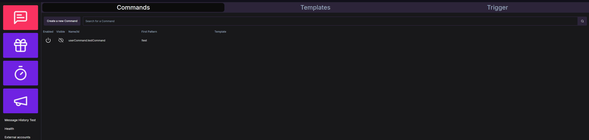

Talium is a Twitch Bot made primarily for [Clym](https://clym.tv) with a focus on reliability and designed with our goals and needs in mind. 
This bot is not designed as a standalone system, instead it is to be integrated with a variety of different and supporting system using docker.

# [Setting up local developing environment](https://github.com/Clym-Dev-Team/Talium/wiki/meta.dev‐setup)

# Goals
- reliability
- concise logging and alerting
- resilience against partial failures
- nice development apis
- documentation (why, and how)
- traceability of user actions
- easy of use as an moderator
- no single user actions resulting in important data loss
- panel being user friendly
- having acceptable cpu, memory, and bandwidth requirements for the bot and panel

## Non Goals
- Live code updates without downtime or image updates
- being general enough for most users
- non-self hosted options (bot as service)
- being the most performant bot possible
  
# System Components
## Required System components 
- A Database, mariadb
- the Backend Bot
- the React & Vite Panel

## Optional System Components
- Reverse Proxy, NginX
  > This is recommended if you want to use a single domain to access all these services

# Features
- Commands
  - Aliases
  - Regex Command Patterns
  - User Cooldowns (Messages and Seconds)
  - Global Cooldowns (Messages and Seconds)
  - Twitch Permissions
  - Automatic List of available commands
  - Change Log
- Timer
  - Using Existing Commands, creating new texts inplace
  - Seconds and Message based interval calculation
  - Timer Groups
  - Only onstream timers 
- Giveaways
  - Multiple Draws
  - Variable amount of Tickets
  - Integrated Timer and Command
  - Change Log
- TipeeeStream
  - Alerts
- Coins & Watchtime
- OAuth Management UI
- Detailed Status Pages
- Login via Twitch
- Shadow Testing
- ChatHistory
  > The Twitch Chatlogs, reimplemented for the whole chat. _Infinite_ history of the entire chat, with searching of the entire history.

# Installation
## Passing configuration values
[Reference](https://docs.spring.io/spring-boot/docs/1.0.1.RELEASE/reference/html/boot-features-external-config.html)

A application.properties file can be placed next to the bot jar file (or in /config in the same dir) for any needed (or to be overwritten) config values

